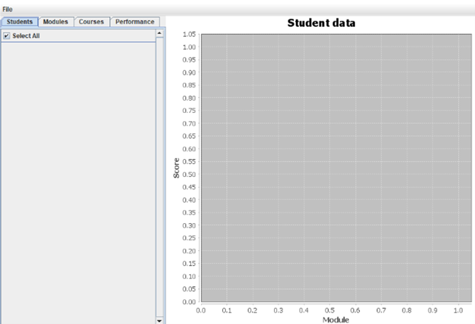
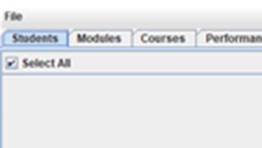
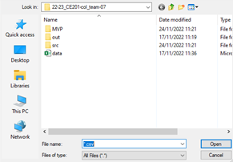
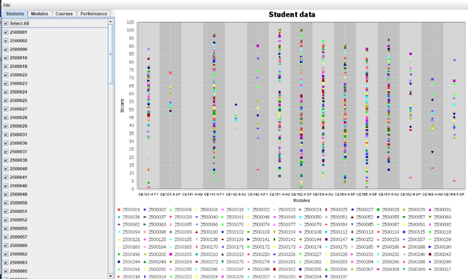
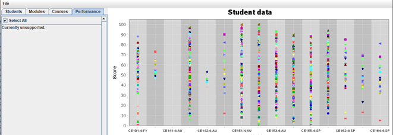

## Product Demonstration ##

When the program first starts, it opens this window. 

To access the data, you must click the File button in the top-left corner. 

Which opens this window, open the "data" file to set the student's data onto the scatter plot. 

The main program will change to this: 

With options to change the scatter plot to filter through modules, courses and specific students.

Currently the program's filter by performance option is still incomplete but that will be implemented in future versions.

### Features and Functions ###

Our program currently only supports hard coded modules and is something we are looking to develop further down the line as some features will not be in use yet due to this being a minimal viable product now. In the future we will look

features we are happy With

 Filtering:  
The program itself allows for filtered sections that consist of different modules, grades and students. It also allows and display the filtration of data via the “svc” file given to us in a clear and easy method.

 Live graph updates: 
The user can gather live updates when choosing what data to view, this includes when unselecting a specific module or student which updates live and is present to view immediately.

 Selection:
The user can select what they want viewed on screen. For example, we have a box next to the module or data on the left that allows you to unselect unique and specific data that will update on our graph.

 Navigation: 
Clear navigation was also key and was implemented by using tabs and scroll features that allowed easy navigation. File dialogue was also used to efficiently to give the best user experience possible

