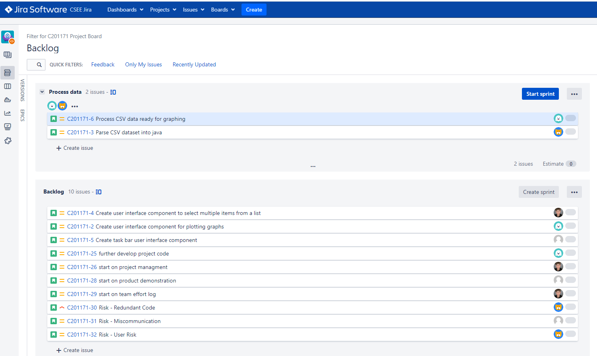

## Project management discussion ##

The team working together has made strides in the few weeks we have spent getting the project to where it should be by using the following. Team scrum master has changed each week to give different insights and tasks to complete. This is to ensure we all have something to do and complete tasks in a time frame set and agreed by us all. All team members find the workload going smoothly as everyone is given goals on Jira and given the set amount of time. With goals saved to Jira and downloads saved to cseegit, it makes it much easier to get the work done as everything is in one place, these tools are used for the benefit and communication of the project. Our team group has made huge efforts on communication and teamwork which has led to a friendly working environment with each other prompting us to be efficient as we can. Overall, this leads to the team settling problems that may arise in quicker fashion due to everyone having a team mindset. The flow of work gets done faster as everyone is enthusiastic to work with each other as everyone is passionate about the project. Scrum meetings are well organized as everyone takes there turn speaking on issues related to the goals that are set or the project, everyone gets a turn to speak and at the end the scrum master has the information to set more worthwhile goals for the team members. We have also made use of a platform called discord where we have been communicating as a team away from normal lessons to understand and develop the project more.
Scrum meeting could be more efficient if we set specific dates that are repeated during the week.  Our stand-up meetings are set on a weekly time schedule. We all believe it can be increased to two times a week instead of one as stand-up meetings are more natural and we get through information more quickly.  One problem that arises is that people arrive late sometimes to the scrum meeting, so punctuality would help with the team’s efficiency and understanding as if one person is late the team gets delayed and then must change our plan to cater for the late arrival. 

### Burndown chart ###

As a group we didn't implement any time estimations to our tasks on jira. This however did not affect our ability to time keep
as everyone in our group was updated on what was needed to be done. We have 2-hour lab sessions which also really helped us to
get everything done in labs that let us concentrate on hard coding our program outside of university lessons.
We also used a different program called discord to communicate of campus and to keep updates as it was more efficient and viable for everyone in our group
to keep track.